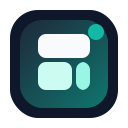
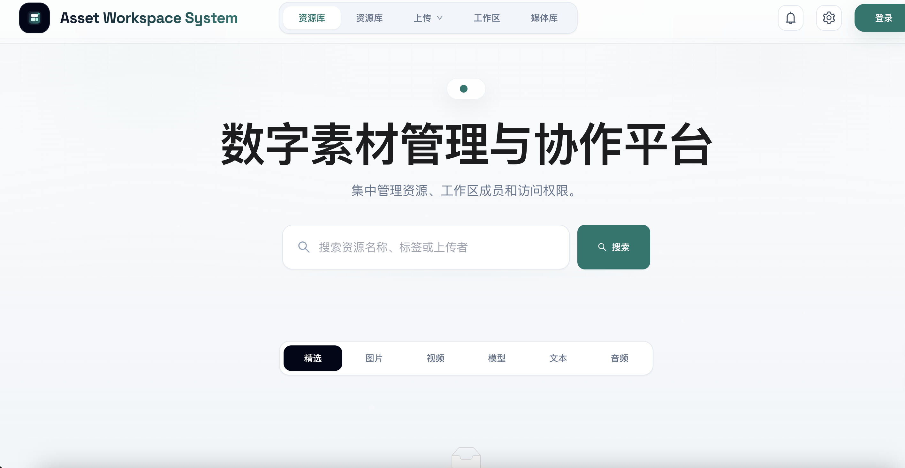
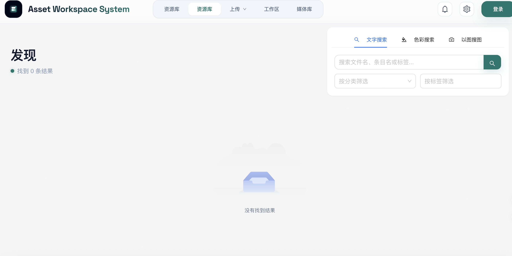
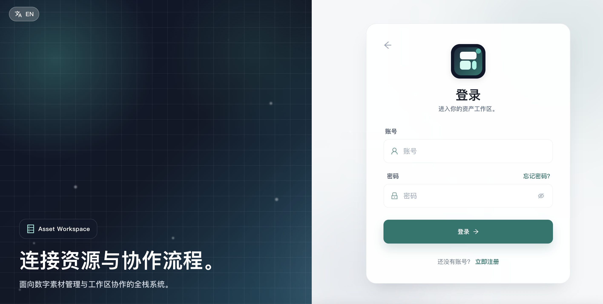
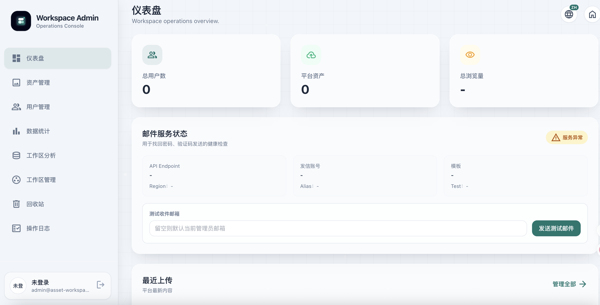
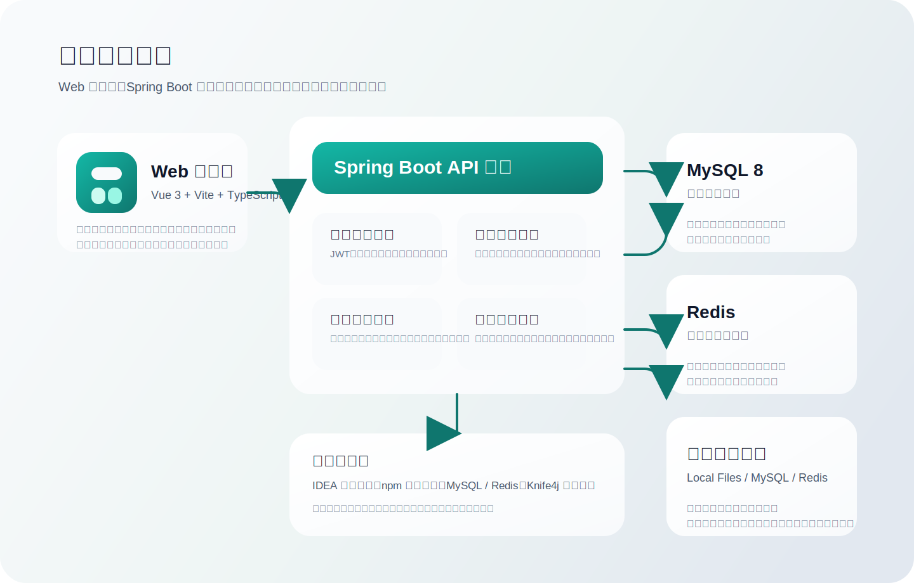

<p align="center">
  
</p>

<h1 align="center">asset-workspace-system</h1>

<p align="center">
  面向个人创作者与小团队的数字素材管理与协作平台
</p>

<p align="center">
  基于 Spring Boot、Vue 3、MySQL 与 Redis 构建，默认采用本地文件存储，兼顾素材管理、团队协作、检索发现与后台治理。
</p>

<p align="center">
  <a href="./LICENSE"></a>
  
  
  
  
  
  
</p>

## 项目简介

`asset-workspace-system` 是一个开源数字素材工作台，聚焦素材沉淀、团队工作区协作与后台运营治理。

项目默认面向本地开发环境，前端可直接使用 `npm` 启动，后端可直接在 IDEA 中以 Maven 项目运行。只要准备好 MySQL、Redis 和本地文件存储目录，就可以完成数据库初始化、接口调试与页面联调。

如果你希望找到一个“能直接跑起来、结构完整、功能闭环明确”的数字资产管理项目，这个仓库的目标就是提供这样一套起点。

## 界面预览

下面的截图覆盖首页展览、资源库、登录页与后台管理页，方便快速了解项目的主要界面结构与视觉风格。

<p align="center">
  
  
</p>

<p align="center">
  
  
</p>

- 首页展览：公开素材展示、搜索入口与内容浏览
- 资源库：个人素材整理、筛选与管理界面
- 登录页：账号登录与访问入口
- 管理后台：后台治理、统计分析与管理操作

## 推荐体验路径

如果你第一次打开这个项目，推荐按下面的顺序浏览：

1. 先进入公开展览页，确认素材展示、搜索与详情链路是否正常。
2. 再登录管理员账号，体验用户管理、素材治理与日志页面。
3. 最后进入工作区页面，检查团队工作区、成员协作与批量整理链路。

## 系统架构

<p align="center">
  
</p>

## 核心能力

### 资产管理

- 支持图片、视频、音频、文档、3D 模型等多类型素材统一管理
- 提供单文件上传、批量导入、预览展示、详情页阅读与附件链路
- 支持本地文件存储与素材目录管理
- 提供编辑锁能力，降低多人并发修改的覆盖风险

### 检索与发现

- 提供关键词搜索、颜色搜索、以图搜图
- 提供公开展览页、素材详情页与个人媒体库
- 支持多媒体内容预览，包括文本阅读、音频播放与 3D 模型查看

### 工作区协作

- 支持个人工作区与团队工作区
- 提供邀请、申请、成员角色与访问控制
- 提供评论、点赞、收藏、通知等互动能力

### 后台治理

- 提供用户管理、素材管理、工作区管理
- 提供统计分析、回收站与敏感操作日志
- 提供接口文档与后台治理入口

## 技术栈

### 后端

- Java 8
- Spring Boot 2.7.6
- MyBatis-Plus
- MySQL 8
- Redis
- JWT 鉴权
- Knife4j 接口文档

### 前端

- Vue 3
- Vite
- TypeScript
- Pinia
- Vue Router
- Tailwind CSS
- Ant Design Vue

## 仓库结构

```text
asset-workspace-system/
├── backend/              Spring Boot API、数据库脚本、本地开发配置
├── docs/                 README 预览图与架构图
├── frontend/             Vue 3 Web 客户端
├── scripts/              本地准备脚本
├── ASSETS_LICENSE.md     素材与外部资源说明
├── CODE_OF_CONDUCT.md    社区行为准则
├── CONTRIBUTING.md       贡献说明
├── LICENSE               开源协议
├── README.md             仓库入口文档
└── SECURITY.md           安全漏洞提交流程
```

## 快速开始

### 1. 环境要求

- Java 8 及以上
- Maven 3.8 及以上
- Node.js 18 及以上
- npm 9 及以上
- MySQL 8
- Redis

### 2. 创建数据库

```sql
CREATE DATABASE asset_workspace_system
DEFAULT CHARACTER SET utf8mb4
DEFAULT COLLATE utf8mb4_unicode_ci;
```

### 3. 导入表结构

```bash
mysql -uroot -p asset_workspace_system < backend/src/main/resources/sql/create_table.sql
```

### 4. 准备本地开发文件

```bash
bash scripts/prepare_local.sh
```

该脚本会完成两件事：

- 若 `backend/.env` 不存在，则基于 `backend/.env.example` 自动生成
- 创建默认本地存储目录 `backend/data/uploads`

如果你更希望手动处理，也可以执行：

```bash
cp backend/.env.example backend/.env
mkdir -p backend/data/uploads
```

推荐至少检查这些配置项：

- `DB_HOST`
- `DB_PORT`
- `DB_NAME`
- `DB_USERNAME`
- `DB_PASSWORD`
- `REDIS_HOST`
- `REDIS_PORT`
- `FILE_STORAGE_TYPE`
- `LOCAL_FILE_STORAGE_PATH`

默认本地文件存储配置如下：

```env
FILE_STORAGE_TYPE=local
LOCAL_FILE_STORAGE_PATH=./data/uploads
```

本地开发阶段按以上数据库、Redis 和文件目录配置即可启动。首次准备推荐优先执行 `bash scripts/prepare_local.sh`。

### 5. 在 IDEA 中启动后端

使用 IDEA 打开 `backend`，等待 Maven 依赖加载完成后，直接运行启动类 `LingtuThinkTankApplication`。

后端默认地址：

- API 基址：`http://localhost:8123/api`
- 接口文档：`http://localhost:8123/api/doc.html`

### 6. 启动前端

```bash
cd frontend
npm install
npm run dev
```

前端默认地址：

- Web：`http://localhost:5173`

### 7. 可选：开启后台权限

如果需要体验后台页面，建议先正常注册一个账号，再手动把该账号提升为管理员：

```sql
UPDATE user
SET userRole = 'admin'
WHERE userAccount = '你的账号';
```

更新后重新登录即可进入后台管理相关页面。

### 8. 本地联调检查

推荐至少确认以下入口可正常访问：

- `http://localhost:5173`
- `http://localhost:8123/api/doc.html`
- 登录、公开素材列表、工作区页面与后台页面

## 开发流程

### 前端开发

```bash
cd frontend
npm install
npm run dev
```

### 后端开发

在 IDEA 中运行 `LingtuThinkTankApplication`

### 常用检查

```bash
cd backend && mvn -q -DskipTests compile
cd frontend && npm run build
```

### 本地验证脚本

```bash
bash scripts/smoke.sh
bash scripts/build_check.sh all
```

- `scripts/smoke.sh` 用于快速检查关键文件、工具链和脚本语法
- `scripts/build_check.sh` 用于执行后端编译与前端构建验证

## 配置说明

### 文件存储

- 默认使用本地文件存储
- 通过 `FILE_STORAGE_TYPE=local` 启用本地目录存储
- 本地运行时确保 `LOCAL_FILE_STORAGE_PATH` 指向一个可写目录

### 邮件服务

- 本地开发不依赖邮件服务配置
- 如需扩展注册验证码或通知链路，可再按代码实现补充相关环境变量

### 接口文档

- 基于 Knife4j 暴露在 `/api/doc.html`

## 适用场景

- 课程设计与毕业设计中的数字素材管理系统
- 个人作品集素材归档
- 小团队的图片、视频、文档、模型协作管理
- 需要一个带前后端完整结构的开源管理平台模板

## 二次开发文档

- [docs/development/secondary-development-guide.md](./docs/development/secondary-development-guide.md)

## 开源发布说明

- 仓库默认面向本地开发环境，`backend/.env` 仅用于本地运行，不应提交到版本库。
- 当前仓库已包含代码、文档截图、SVG 标识与前端静态素材。公开发布前，请先核对这些文件是否都具备可再分发授权，详细说明见 [ASSETS_LICENSE.md](./ASSETS_LICENSE.md)。
- 部分功能或界面依赖外部资源与第三方服务，包括 Google Fonts、Transparent Textures 背景纹理、Bing 图片抓取链路，以及可选的阿里云 OSS / 邮件能力。若你的部署环境对外联、隐私或合规性有更严格要求，建议改为本地静态资源或在发布版本中关闭相关能力。
- 社区行为边界见 [CODE_OF_CONDUCT.md](./CODE_OF_CONDUCT.md)，安全漏洞提交流程见 [SECURITY.md](./SECURITY.md)。

## 贡献

欢迎围绕以下方向提交改进：

- 文档完善与 README 体验优化
- 功能稳定性与异常处理增强
- 检索、协作、后台治理能力补强
- 本地开发体验与可观测性改进

提交代码前建议先阅读：

- [CODE_OF_CONDUCT.md](./CODE_OF_CONDUCT.md)
- [CONTRIBUTING.md](./CONTRIBUTING.md)
- [SECURITY.md](./SECURITY.md)

## 开源协议

本项目基于 [GPL-3.0](./LICENSE) 开源。
